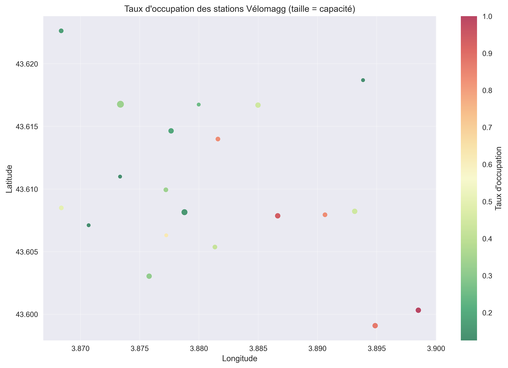
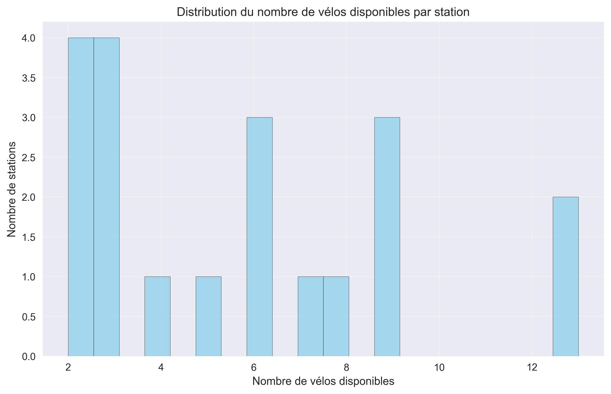
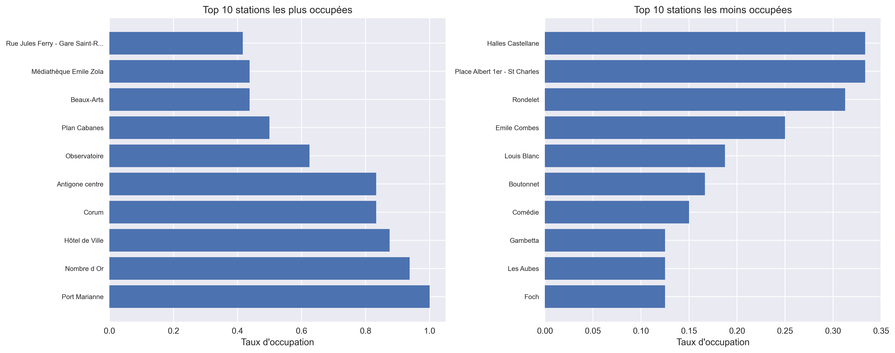

# 🚴‍♂️ VéloMAG Stats

**Tableau de bord interactif des vélos en libre-service de Montpellier**

[](https://fabienbounoir.github.io/velomagg-stats)
[](https://python.org)
[](https://portail-api-data.montpellier3m.fr)

## 📊 Aperçu

Ce projet analyse en temps réel les **20 stations VéloMAG** de Montpellier et génère automatiquement :
- 🗺️ **Carte interactive** avec localisation des stations
- 📈 **Dashboard** avec graphiques et statistiques  
- 📱 **Site web responsive** hébergé sur GitHub Pages
- 📋 **Rapports** automatisés (CSV, JSON)

## 🎯 Démarrage rapide

```bash
# 1. Cloner le projet
git clone https://github.com/FabienBounoir/velomagg-stats.git
cd velomagg-stats

# 2. Lancer l'analyse
./run.sh

# 3. Voir les résultats
open carte_velomagg.html
```

## 📸 Captures d'écran

### 🗺️ Carte interactive des stations


### � Distribution des vélos par station  


### 🏆 Classement des stations


## 🚀 Déploiement GitHub Pages

Pour créer votre propre site :

```bash
# Configuration automatique
./init-github-pages.sh

# Mise à jour des données
./update_carte.sh
```

➡️ **Votre site sera accessible à :** `https://VOTRE-USERNAME.github.io/velomagg-stats`

## � Mise à jour automatique

- ⏰ **2 fois par jour** (8h et 20h UTC) via GitHub Actions
- 🔄 **Manuel** avec `./update_carte.sh`
- 📡 **Temps réel** depuis l'API officielle Montpellier3M

## � Fichiers générés

| Type | Fichier | Description |
|------|---------|-------------|
| 🌐 | `carte_velomagg.html` | Carte interactive Leaflet |
| 📊 | `dashboard_velomagg.html` | Tableau de bord complet |
| 📈 | `temporal_analysis.html` | Analyse temporelle |
| 📋 | `velomagg_analysis.csv` | Données brutes (Excel) |
| 🎨 | `visualizations/*.png` | Graphiques haute résolution |

## �️ Technologies

- **Backend**: Python (pandas, matplotlib, plotly, folium)
- **Frontend**: HTML5, Bootstrap 5, Leaflet.js
- **API**: Montpellier Métropole Open Data
- **Déploiement**: GitHub Pages + Actions

---

💡 **Données fournies par l'API officielle de [Montpellier Métropole](https://portail-api-data.montpellier3m.fr)**
