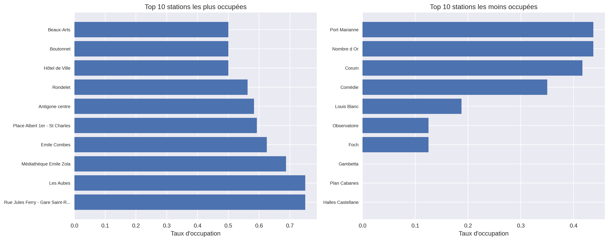

# 🚴‍♂️ VéloMAG Stats

**Tableau de bord interactif des vélos en libre-service de Montpellier**

[](https://fabienbounoir.github.io/velomagg-stats)
[](https://python.org)
[](https://portail-api-data.montpellier3m.fr)

## 📊 Aperçu

Ce projet analyse en temps réel les **20 stations VéloMAG** de Montpellier et génère automatiquement :
- 🗺️ **Carte interactive** avec localisation des stations
- 📈 **Dashboard** avec graphiques et statistiques  
- 📱 **Site web responsive** hébergé sur GitHub Pages
- 📋 **Rapports** automatisés (CSV, JSON)

## 🎯 Démarrage rapide

```bash
# 1. Cloner le projet
git clone https://github.com/FabienBounoir/velomagg-stats.git
cd velomagg-stats

# 2. Lancer l'analyse
./run.sh

# 3. Voir les résultats
open docs/index.html
```

## 📸 Captures d'écran

### 🗺️ Carte interactive des stations


### 📊 Distribution des vélos par station  


### 🏆 Classement des stations


## 🚀 Déploiement GitHub Pages

Pour créer votre propre site :

```bash
# Configuration automatique
./init-github-pages.sh

# Mise à jour des données
./update_carte.sh
```

➡️ **Votre site sera accessible à :** `https://VOTRE-USERNAME.github.io/velomagg-stats`

## 🔄 Mise à jour automatique

- ⏰ **2 fois par jour** (8h et 20h UTC) via GitHub Actions
- 🔄 **Manuel** avec `./update_carte.sh`
- 📡 **Temps réel** depuis l'API officielle Montpellier3M

## 📁 Structure du projet

```
velomagg-stats/
├── 🐍 Scripts Python
│   ├── main.py                 # Script principal d'analyse
│   ├── interactive_viz.py      # Visualisations interactives
│   └── advanced_analytics.py   # Analyses avancées
│
├── ⚙️ Scripts de gestion
│   ├── run.sh                  # Lancement principal
│   ├── update_carte.sh         # Mise à jour complète
│   └── organize_files.sh       # Organisation GitHub Pages
│
├── 🛠️ scripts/                 # Utilitaires
│   ├── clean.py               # Nettoyage données
│   └── test_auto_update.sh    # Tests
│
├── 📚 docs-projet/             # Documentation technique
│   └── *.md                   # Guides détaillés
│
├── 🌐 docs/                    # Site GitHub Pages
│   ├── index.html             # Interface web
│   ├── data/                  # Données (CSV, JSON)
│   └── visualizations/        # Images PNG
│
└── ⚙️ .github/workflows/       # Automation
    └── update-data.yml         # Mise à jour auto
```

## 🛠️ Technologies

- **Backend**: Python (pandas, matplotlib, plotly, folium)
- **Frontend**: HTML5, Bootstrap 5, Leaflet.js
- **API**: Montpellier Métropole Open Data
- **Déploiement**: GitHub Pages + Actions

## 📚 Documentation

Pour plus de détails, consultez la [documentation technique](docs-projet/) :
- [Guide principal](docs-projet/GUIDE.md)
- [Guide des visualisations](docs-projet/GUIDE_VISUALISATIONS.md)
- [Guide de déploiement](docs-projet/DEPLOIEMENT_GITHUB_PAGES.md)

---

💡 **Données fournies par l'API officielle de [Montpellier Métropole](https://portail-api-data.montpellier3m.fr)**
